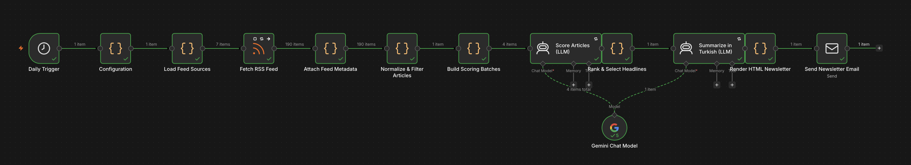
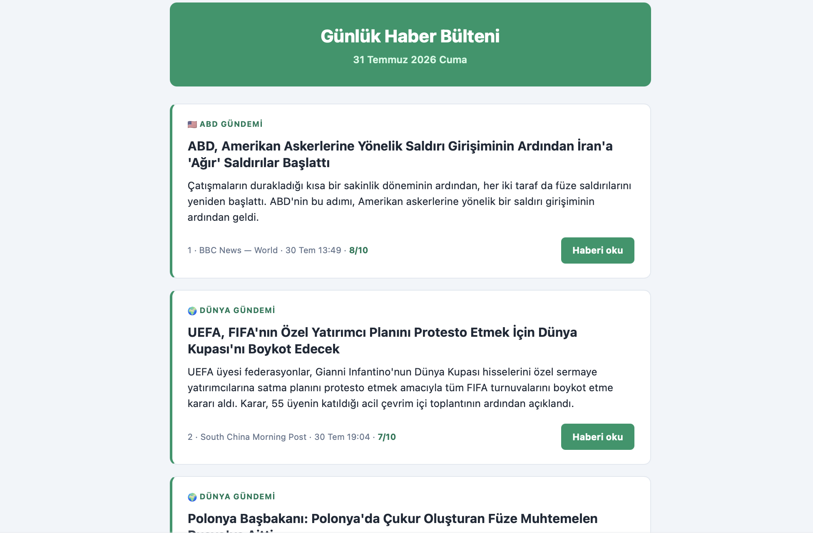

# AI Daily News Reporter

An n8n workflow that reads seven international news feeds every morning, uses
an LLM to score each story's editorial importance, and emails the selected
stories as a Turkish-language HTML newsletter.

## How it works

**Ingestion.** Reads 7 RSS feeds (SCMP, Le Monde, NYT, CNBC, TechCrunch, WIRED,
BBC). Failed feeds are tolerated rather than crashing the run.

**Normalization.** Strips HTML entities and tracking parameters, deduplicates by
URL and normalized title, filters out non-news content (sports, lifestyle,
galleries, puzzles), and assigns an editorial category to each article.

**Scoring.** Articles are split into four category-balanced batches and sent to
Gemini Flash with a rubric that defines 6 as the publication threshold. The
prompt includes explicit score caps for analysis pieces, speculation, and
single-company news to prevent grade inflation.

**Validation.** Every model response is checked for missing IDs, duplicate IDs,
and out-of-range scores. Any violation stops the run.

**Selection.** Ranked by score, capped at 5 stories per category and 7 per
source so no single desk or publisher dominates the issue.

**Summarization.** A second LLM call writes Turkish headlines and summaries. The
prompt requires preserving the source's level of certainty — hedged wording like
*may* or *reportedly* stays hedged in translation.

**Delivery.** Rendered as table-based HTML plus a plain-text alternative, sent
as a multipart email.

## Design notes

The workflow has three gates that stop execution rather than degrade output:

| Gate | Condition | Rationale |
|---|---|---|
| Feed health | At least 5 sources responded | A newsletter built from 2 feeds isn't a news digest |
| Scoring coverage | Every article received a valid score | Silent omissions would look like editorial choices |
| Editorial threshold | At least 8 stories passed the bar | A 3-story issue signals a pipeline problem, not a slow news day |

The tradeoff is deliberate: sending nothing is better than sending something
incomplete without saying so.

All tuning parameters live in a single `Configuration` node — no values are
hardcoded elsewhere in the workflow.

## Requirements

- n8n v1.x
- Google Gemini API key
- SMTP account

## Setup

1. Import `ai-daily-news-reporter.json` via **Workflows → Import from File**.
2. Add a Google Gemini credential to the `Gemini Chat Model` node.
3. Add an SMTP credential to the `Send Newsletter Email` node.
4. Set `senderEmail` and `recipientEmail` in the `Configuration` node.
5. Adjust `timeZone` if you are not in `Europe/Istanbul`.

## Configuration

| Parameter | Default | Description |
|---|---|---|
| `lookbackHours` | 24 | Maximum article age |
| `maxArticlesPerSource` | 70 | Caps a single feed's contribution |
| `minHealthySources` | 5 | Below this, the run stops |
| `snippetLength` | 600 | Text budget sent to the model |
| `targetBatchCount` | 4 | Number of scoring calls |
| `maxHeadlines` | 25 | Upper bound per issue |
| `minHeadlines` | 8 | Below this, no email is sent |
| `maxPerCategory` | 5 | Prevents one category dominating |
| `maxPerSource` | 7 | Prevents one publisher dominating |

## Output

Summaries are LLM-generated. Original headlines and links belong to their
respective publishers.

## License

MIT
